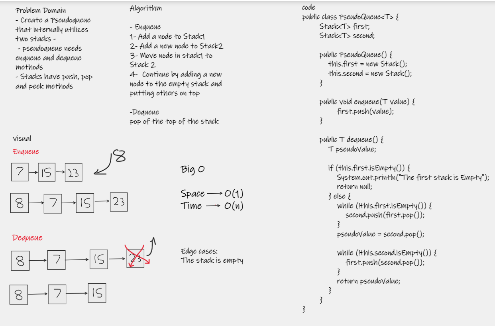

# Implement a Queue using two Stacks.

# Challenge
Create a new class called PseudoQueue. Do not use an existing Queue. Instead, this PseudoQueue class will implement
the standard queue interface, but will internally only utilize 2 Stack objects. Ensure that you create your class with
the following methods:

- enqueue(value) which inserts value into the PseudoQueue, using a first-in, first-out approach.  
- dequeue() which extracts a value from the PseudoQueue, using a first-in, first-out approach.
The Stack instances have only push, pop, and peek methods.  
You should use your own Stack implementation. Instantiate these Stack objects in your PseudoQueue constructor.

# Approach & Efficiency
Due to the restrictions given in the instructions I had to move everything from my first stack into my second in order to 
enqueue a new node to end.

enqueue : time O(1), memory O(1) because we only push an element to stack1.  
dequeue : time O(n), memory O(n) because we loop over stack1 to reverse it in stack2 to pop the last(becomes the first
          element and then reverse it back to stack1.

# WhiteBoard 

