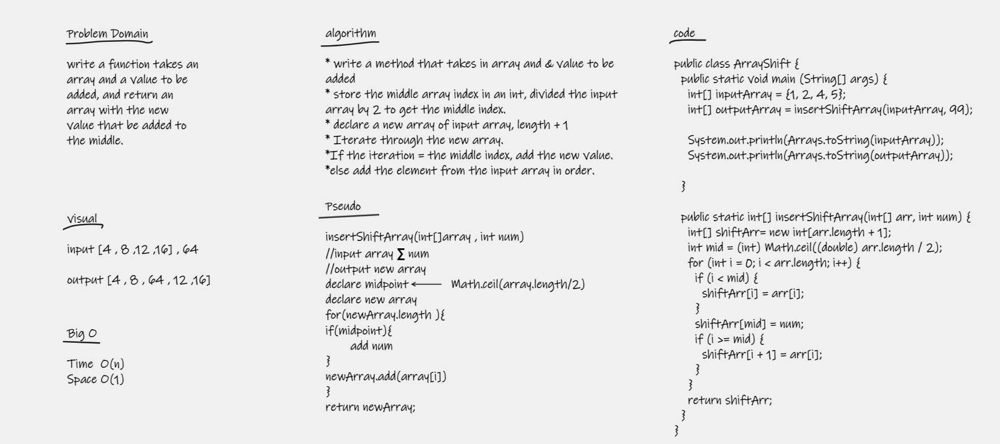

#array-insert-shift
In this challenge, we should add an element to an array in the middle of it.

#Whiteboard 

#Approach & Efficiency
- create a new empty array for output
- find out the midpoint index by dividing the length and rounding up for arrays with an odd length
- All items before the midpoint can stay in place
- All items after the midpoint need to be shifted by to an index of +1 to their original index