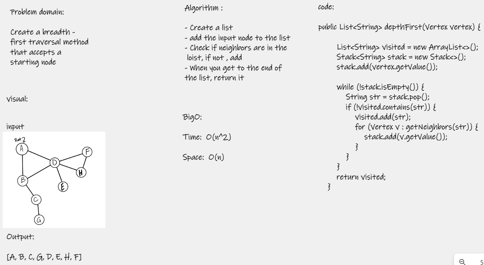

# Breadth First Traversal - Graphs  

Extend your graph object with a breadth-first traversal method that accepts a starting node that returns a collection of nodes in the order 
they were visited. Display the collection.  

# Challenge  

- Can't user any built-in methods available to Java.  
- Graphs don't have a specific order  
- Nodes can be neighbors of any other node

# Approach & Efficiency  

- Time: O(n^2)   
- Space: O(n)   

# WhiteBoard  

  

