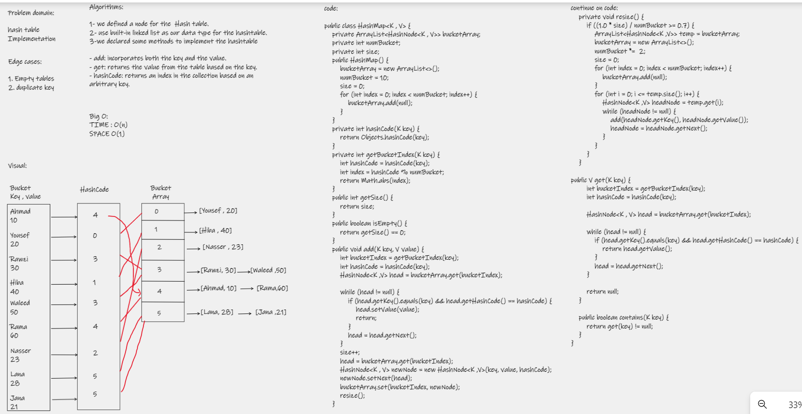

# Hashtable  
A hash table data structure was created from the ground up.  

# Challenge  
implementation from scratch

# Approach & Efficiency
add: incorporates both the key and the value.  

get: returns the value from the table based on the key.  

hashCode: returns an index in the collection based on an arbitrary key.  

contains: returns the boolean (True / False) from the table based on the key.  

# API
add() incorporates both the key and the value.  

get() returns the value from the table based on the key.  

hashCode() returns an index in the collection based on an arbitrary key.  

resize() specify a new hash table size

isEmpty() check to see if the hash table is empty or not.  

contains() returns the boolean (True / False) from the table based on the key.  

# WhiteBoard  

