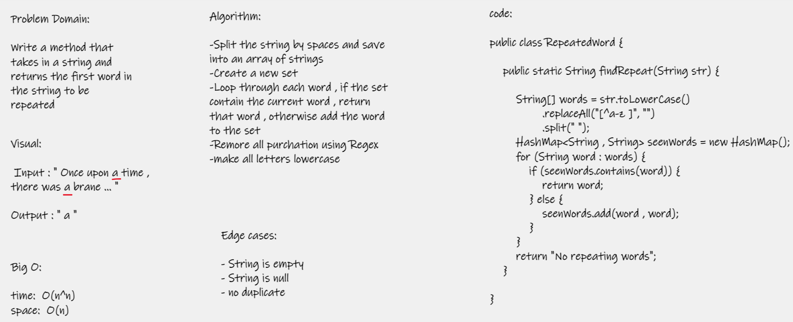

# First repeated word
Code challenge 31 - find the first repeated word in a book  

# Challenge  
Write a function that accepts a lengthy string parameter. Without utilizing any of the built-in library methods available to your
language, return the first word to occur more than once in that provided string  

# Approach & Efficiency  
O(n) time - loops through the input string  
O(n) space - stores each unique value of the input string  

# WhiteBoard  
