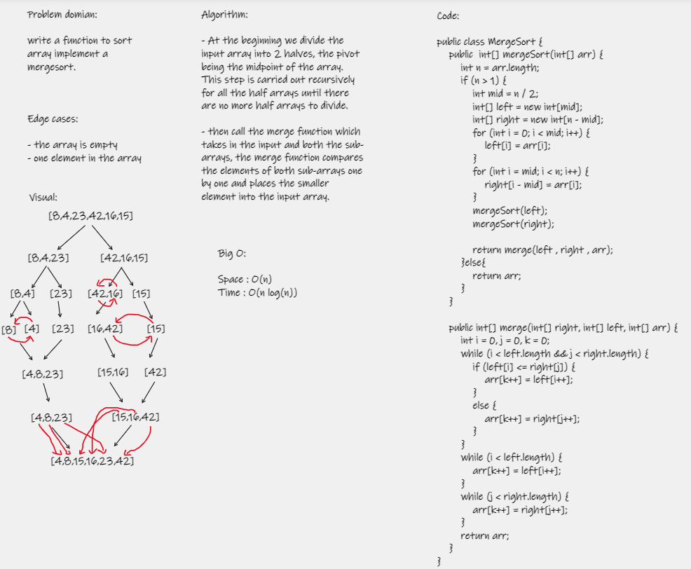

# Merge Sort
Sorting an array by dividing it in half numerous times until it is sorted and merge-able, and then merging it.  

# Pseudocode
Mergesort(arr) DECLARE n <-- arr.length  

```
if n > 1
DECLARE mid <-- n/2
DECLARE left <-- arr[0...mid]
DECLARE right <-- arr[mid...n]
// sort the left side
Mergesort(left)
// sort the right side
Mergesort(right)
// merge the sorted left and right sides together
Merge(left, right, arr)
while i < left.length && j < right.length
if left[i] <= right[j]
arr[k] <-- left[i]
i <-- i + 1
else
arr[k] <-- right[j]
j <-- j + 1

    k <-- k + 1

if i = left.length
set remaining entries in arr to remaining values in right
else
set remaining entries in arr to remaining values in left
```

# Trace
Sample Array: [8,4,23,42,16,15]

Pass 1  
First will pass through the array, and then split the array in two.  

Pass 2
The array is split into two separate arrays.  

Pass 3  
The two arrays will split again.  

Pass 4  
The left side will be sorted.  

Pass 5  
The right side will be sorted  

Pass 6  
Both sides will merge once the sorting is done.  

Pass 7  
Final iteration will the finished merged array. 

# WhiteBoard  

  

# Efficiency
Time: O(n log n) / Space: O(n log n)  

