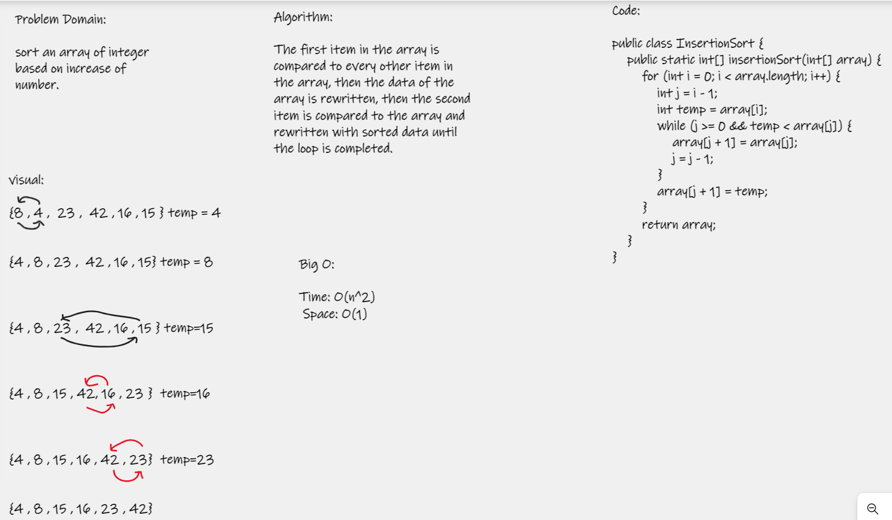

# Insertion Sort
Using insertion sort, sorts array items from least to biggest number.  

Pseudocode  

```
InsertionSort(int[] arr)
FOR i = 1 to arr.length

int j <-- i - 1
int temp <-- arr[i]

WHILE j >= 0 AND temp < arr[j]
arr[j + 1] <-- arr[j]
j <-- j - 1

arr[j + 1] <-- temp
```  

Trace
Sample Array: [8,4,23,42,16,15]
Pass 1

The array will be traversed first, and the numbers in the array will be compared. The array will be divided into two parts: sorted and unsorted.  
In the next passes, the unsorted numbers will be selected and placed in the appropriate locations.

Pass 2

The second pass will swap the 8 and the 4.

Pass 3

The second pass will swap the 23 and the 15.

Pass 4

The second pass will swap the 42 and the 16.

Pass 5

The second pass will swap the 42 and the 23.  

# Efficiency  

Time: O(n^2)  
Space: O(1)  

# WhiteBoard  

