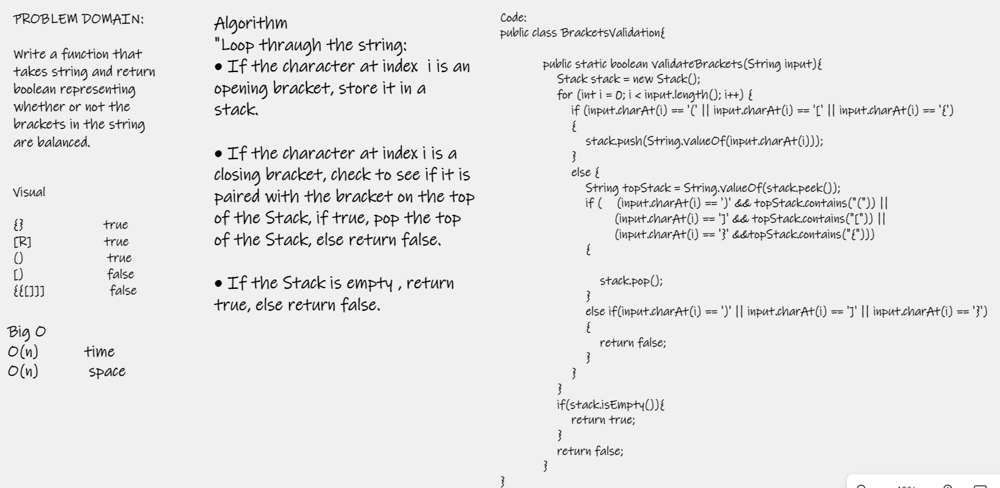

# Multi-bracket Validation  

Continuing our work with stacks and queueus

# Challenge
Your function should take a string as its only argument, and should return a boolean representing whether or not the brackets in the string are balanced. There are 3 types of brackets:  

- Round Brackets : ()  
- Square Brackets : []  
- Curly Brackets : {}  

# Approach & Efficiency
I used a stack to keep track of the order of opening brackets. Since the methods time and space efficiency will always be dependent on the data passed in, the most efficient it could be is O(n).  

- O(n) Time  
- O(n) Space  

# WhiteBoard  

