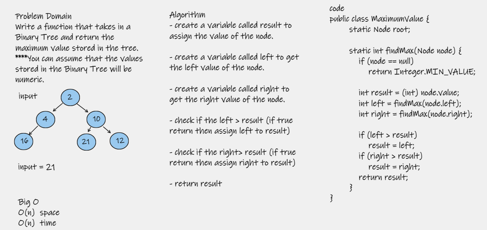

# Find the Maximum Value in a Binary Tree
Find the max value in a binary tree

# Challenge
Write a function called find-maximum-value which takes binary tree as its only input. Without utilizing any of the built-in
methods available to your language, return the maximum value stored in the tree. You can assume that the values stored in
the Binary Tree will be numeric

# Approach & Efficiency
I recursively iterated through the tree that was passed in as an argument, by created 3 variables result, left, and right
and comparing left and right variables to a result variable. If any value was greater than the result, result was set to
that value.

# WhiteBoard  
