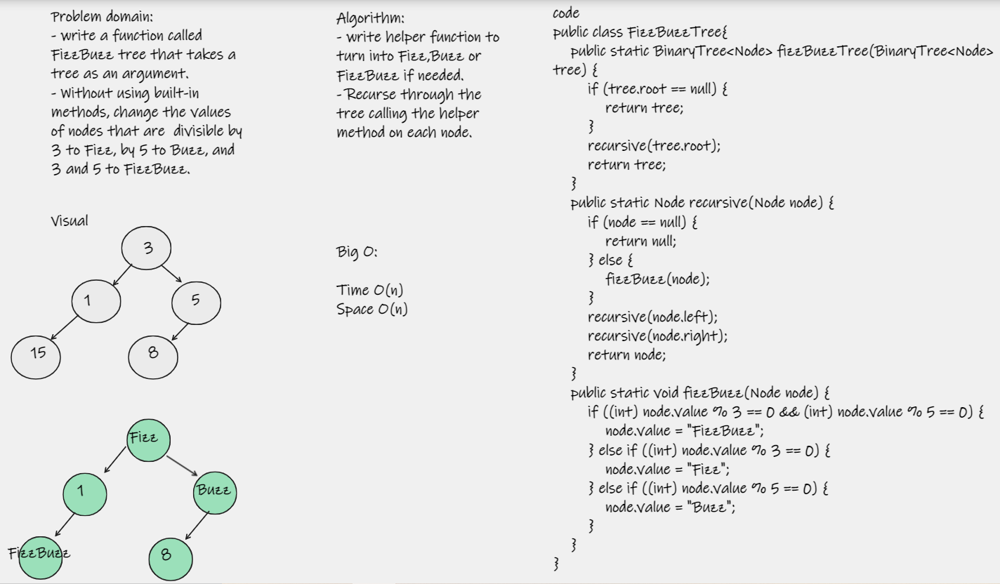

# FizzBuzz Tree  
Conduct “FizzBuzz” on a tree while traversing through it. Change the values of each of the nodes dependent on the current node’s value

# Challenge
Write a function called FizzBuzzTree which takes a tree as an argument. Without utilizing any of the built-in methods available to your language, determine weather or not the value of each node is divisible by 3, 5 or both, and change the value of each of the nodes:

If the value is divisible by 3, replace the value with “Fizz” 
If the value is divisible by 5, replace the value with “Buzz” 
If the value is divisible by 3 and 5, replace the value with “FizzBuzz” 

# Approach & Efficiency
I used recursion to complete this challenge as it's the most elegant way to move through each node in a tree.  

# Big O:
- Time: O(n)
- Space: O(n) 

# WhiteBoard

