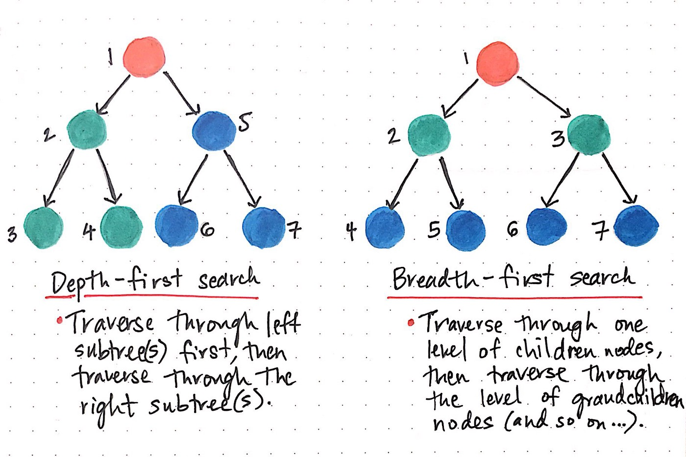

# Trees
In this tutorial I learned Binary Trees and Binary Search Trees.

#### Some common terminology in this class  
- Node - A Tree node is a component which may contain its own values, and references to other nodes
- Root - The root is the node at the beginning of the tree
- Left - A reference to one child node, in a binary tree
- Right - A reference to the other child node, in a binary tree  

###### Example on tree:

  

#### Traversals  

An important aspect of trees is how to traverse them. Traversing a tree allows us to search for a node,
print out the contents of a tree, and much more! There are two categories of traversals when it comes to trees:  

- Depth First  
- Breadth First  

#### Depth First  
Depth first traversal is where we prioritize going through the depth (height) of the tree first.  

#### Here are three methods for depth first traversal:  

- Pre-order: root >> left >> right  
- In-order: left >> root >> right  
- Post-order: left >> right >> root  

#### Examples on methods above:

- Pre-order: A, B, D, E, C, F  
- In-order: D, B, E, A, F, C  
- Post-order: D, E, B, F, C, A  

#### Breadth First
Breadth first traversal iterates through the tree by going through each level of the tree node-by-node.  
 
Traditionally, breadth first traversal uses a queue (instead of the call stack via recursion) to
traverse the width/breadth of the tree. Let’s break down the process. 

